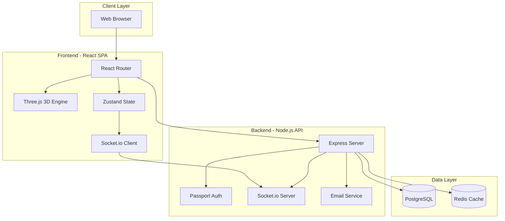

<div align="center">


# 🗺️ UCE Interactive 3D Campus Map

**Immersive Visualization Platform & Academic Management System**

[](https://react.dev/)
[](https://threejs.org/)
[](https://nodejs.org/)
[](https://www.docker.com/)
[](https://www.postgresql.org/)

<p align="center">
  <a href="#-features">Features</a> •
  <a href="#-demo">Demo</a> •
  <a href="#-tech-stack">Tech Stack</a> •
  <a href="#-installation">Installation</a> •
  <a href="#-architecture">Architecture</a> •
  <a href="#-api-documentation">API</a>
</p>

<p align="center">
  <strong>
    <a href="./README.es.md">🇪🇸 Leer en Español</a>
  </strong>
</p>

</div>

---

## 📖 About The Project

**UCE Interactive 3D Campus Map** is an advanced technological solution designed for **Universidad Central del Ecuador (UCE)**. It modernizes the university navigation experience by combining an interactive 3D environment with a robust event and facility management system.

The platform enables students and visitors to virtually explore the campus while administrators manage institutional information through a secure control panel with real-time analytics.

### 🎯 Project Goals

- **Enhance Campus Navigation**: Provide an intuitive, immersive way to explore university facilities
- **Centralize Event Management**: Unified platform for academic event scheduling and discovery
- **Real-time Analytics**: Track visitor engagement and popular locations
- **Accessibility**: Mobile-responsive design for on-the-go access
- **Scalability**: Microservices architecture ready for future expansion

> **Status:** 🚀 Production Ready | **Version:** 2.0.0 | **Last Updated:** February 2026

---

## ✨ Features

### 🌍 Interactive 3D Exploration

<details>
<summary><b>Dual Navigation Modes</b></summary>

- **Satellite View**: Bird's-eye perspective with orbital controls (zoom, rotate, pan)
- **First-Person Mode (FPS)**: Ground-level exploration with WASD controls
  - Variable speed (Shift to sprint, Ctrl to crouch)
  - Smooth camera transitions
  - Collision detection
  - Interactive crosshair and control hints

</details>

<details>
<summary><b>Smart Building Detection</b></summary>

- **Proximity-Based Interaction**: Automatic information display when approaching buildings
  - **25m range**: Building info card appears
  - **18m range**: Events modal opens (for active events)
  - **12m range**: Visit automatically registered
- **Edge-Based Distance Calculation**: Accounts for building size, not just center point
- **Intelligent Switching**: Seamlessly transitions between nearby buildings

</details>

<details>
<summary><b>Real-Time Building Information</b></summary>

- **Dynamic Status Indicators**: Open/Closed status based on current time
- **Schedule Display**: Operating hours with visual indicators
- **Category Tags**: Faculty, Library, Administrative, etc.
- **Event Notifications**: Pop-ups for ongoing events
- **Image Galleries**: Building photos and descriptions

</details>

### 🎓 Student Features

<details>
<summary><b>Personalized Experience</b></summary>

- **Faculty Pin**: Your assigned faculty highlighted with custom marker
- **Welcome Animation**: Automatic fly-to animation on first login
- **My Agenda**: Personal event calendar with subscription management
- **Event Discovery**: Browse all campus events by location
- **Smart Search**: Instant search for buildings, faculties, and services

</details>

<details>
<summary><b>Event Management</b></summary>

- **Event Subscriptions**: Save events to personal calendar
- **Email Notifications**: Automatic reminders for subscribed events
- **Filtering Options**: By date, location, category
- **Event Details**: Time, location, description, organizer info
- **Real-Time Updates**: WebSocket-powered live event changes

</details>

### 👨‍💼 Administrator Dashboard

<details>
<summary><b>Analytics & Insights</b></summary>

- **Visit Tracking**: Real-time visitor statistics per building
- **Event Metrics**: Attendance tracking and engagement analysis
- **Interactive Charts**: 
  - Visit distribution by faculty
  - Event timeline visualization
  - Peak hours analysis
  - User engagement trends
- **Export Capabilities**: Download reports in CSV/PDF format

</details>

<details>
<summary><b>Content Management</b></summary>

- **Event CRUD**: Create, edit, delete academic events
  - Rich text editor for descriptions
  - Image upload support
  - Recurring event scheduling
  - Email notification triggers
- **Location Management**: Update building information
  - Operating hours configuration
  - Category assignment
  - 3D model mapping
  - Image gallery management
- **User Management**: Role-based access control (Admin, Student, Guest)

</details>

### 🔐 Security & Authentication

<details>
<summary><b>Multi-Factor Authentication</b></summary>

- **Hybrid Login System**:
  - Google OAuth 2.0 integration
  - Institutional credentials (email/password)
  - JWT-based session management
- **Email Verification**: Secure account activation
- **Password Recovery**: Token-based reset flow
- **Role-Based Access**: Granular permission system

</details>

### 🌐 Real-Time Features

<details>
<summary><b>WebSocket Integration</b></summary>

- **Live Event Updates**: Instant notifications for new/modified events
- **Analytics Streaming**: Real-time dashboard updates
- **Concurrent User Support**: Socket.io-powered connections
- **Automatic Reconnection**: Resilient connection handling

</details>

### 🎨 UI/UX Excellence

<details>
<summary><b>Design System</b></summary>

- **Dark/Light Theme**: Automatic theme switching with smooth transitions
- **Responsive Design**: Optimized for mobile, tablet, and desktop
- **Accessibility**: WCAG 2.1 compliant
- **Animations**: GSAP-powered smooth transitions
- **Loading States**: Skeleton screens and progress indicators
- **Error Handling**: User-friendly error messages

</details>

---

## 🖼️ Screenshots

> **Note**: Screenshots can be hosted on Backblaze B2 for optimal performance

| Satellite View | FPS Mode |
|:---:|:---:|
|  |  |
| **Building Info Card** | **Events Modal** |
|  |  |
| **Admin Dashboard** | **Analytics** |
|  |  |

---

## 🛠️ Tech Stack

### Frontend

| Technology | Purpose | Version |
|:---|:---|:---:|
| **React** | UI Framework | 18.3.1 |
| **Vite** | Build Tool & Dev Server | 6.0.5 |
| **Three.js** | 3D Graphics Engine | 0.171.0 |
| **React Three Fiber** | React Renderer for Three.js | 8.18.3 |
| **React Three Drei** | Three.js Helpers | 9.119.1 |
| **TailwindCSS** | Utility-First CSS | 3.4.17 |
| **Zustand** | State Management | 5.0.2 |
| **React Router** | Client-Side Routing | 7.1.1 |
| **Axios** | HTTP Client | 1.7.9 |
| **Socket.io Client** | WebSocket Client | 4.8.1 |
| **GSAP** | Animation Library | 3.12.5 |
| **Recharts** | Data Visualization | 2.15.0 |
| **Lucide React** | Icon Library | 0.468.0 |

### Backend

| Technology | Purpose | Version |
|:---|:---|:---:|
| **Node.js** | Runtime Environment | 22.x |
| **Express** | Web Framework | 4.21.2 |
| **PostgreSQL** | Relational Database | 15 |
| **Redis** | Caching Layer | Alpine |
| **Passport.js** | Authentication | 0.7.0 |
| **JWT** | Token Management | 9.0.2 |
| **Bcrypt** | Password Hashing | 5.1.1 |
| **Nodemailer** | Email Service | 6.9.16 |
| **Socket.io** | WebSocket Server | 4.8.1 |
| **Multer** | File Upload | 1.4.5-lts.1 |

### DevOps & Infrastructure

| Technology | Purpose |
|:---|:---|
| **Docker** | Containerization |
| **Docker Compose** | Multi-Container Orchestration |
| **Nginx** | Reverse Proxy & Static Serving |
| **PgAdmin** | PostgreSQL Management UI |
| **Redis Commander** | Redis Management UI |

---

## 🚀 Installation

### Prerequisites

- **Docker Desktop** (v20.10+) - [Download](https://www.docker.com/products/docker-desktop)
- **Git** - [Download](https://git-scm.com/downloads)
- **Node.js** (v22+) - Optional, for local development

### Quick Start (Docker - Recommended)

1. **Clone the Repository**

```bash
git clone https://github.com/yourusername/uce-interactive-map.git
cd uce-interactive-map
```

2. **Configure Environment Variables**

Create `.env` file in `Backend/` directory:

```env
# Database Configuration
DB_HOST=postgres_db
DB_USER=admin_sql
DB_PASSWORD=your_secure_password
DB_NAME=uce_main_db
DB_PORT=5432

# Redis Configuration
REDIS_HOST=redis_cache
REDIS_PORT=6379

# JWT Secret
JWT_SECRET=your_jwt_secret_key_change_in_production

# Email Configuration (Gmail example)
EMAIL_USER=your-email@gmail.com
EMAIL_PASS=your-app-specific-password

# Google OAuth (Optional)
GOOGLE_CLIENT_ID=your_google_client_id
GOOGLE_CLIENT_SECRET=your_google_client_secret

# Upload Path
UPLOAD_PATH=/app/public/uploads
```

3. **Start All Services**

```bash
docker-compose up -d --build
```

This command will:
- Build the frontend (production build with Vite)
- Start the backend API server
- Initialize PostgreSQL database
- Start Redis cache
- Launch PgAdmin and Redis Commander

4. **Access the Application**

| Service | URL | Credentials |
|:---|:---|:---|
| **🌐 Web Application** | http://localhost | - |
| **🔌 API Server** | http://localhost:5000 | - |
| **🐘 PgAdmin** | http://localhost:5050 | admin-mapa@uce.edu.ec / admin |
| **📊 Redis Commander** | http://localhost:8082 | - |

5. **Initialize Database**

The database schema will be automatically created on first run. To seed initial data:

```bash
docker exec -it uce_backend npm run seed
```

### Local Development (Without Docker)

<details>
<summary><b>Click to expand local setup instructions</b></summary>

**Frontend Setup**

```bash
cd Frontend
npm install
npm run dev
```

Frontend will run on `http://localhost:5173`

**Backend Setup**

```bash
cd Backend
npm install

# Create .env file with local database credentials
# DB_HOST=localhost
# DB_PORT=5432
# etc.

npm run dev
```

Backend will run on `http://localhost:5000`

**Database Setup**

Install PostgreSQL and Redis locally, then run migrations:

```bash
cd Backend
npm run migrate
npm run seed
```

</details>

---

## 🏗️ Architecture

### System Architecture



### Database Schema

**PostgreSQL Tables:**

- `users` - User accounts and authentication
- `locations` - Building/facility information
- `events` - Academic events and activities
- `visits` - Visit tracking analytics
- `event_subscriptions` - User event subscriptions

**Redis Keys:**

- `locations:all` - Cached location list
- `events:upcoming` - Cached upcoming events
- `session:{userId}` - User session data

### API Architecture

RESTful API with the following endpoints:

<details>
<summary><b>Authentication Endpoints</b></summary>

- `POST /api/register` - User registration
- `POST /api/login` - User login
- `POST /api/logout` - User logout
- `GET /api/profile` - Get user profile
- `POST /api/verify-email` - Email verification
- `POST /api/forgot-password` - Password reset request
- `POST /api/reset-password` - Password reset

</details>

<details>
<summary><b>Location Endpoints</b></summary>

- `GET /api/locations` - Get all locations
- `GET /api/locations/:id` - Get location by ID
- `POST /api/locations` - Create location (Admin)
- `PUT /api/locations/:id` - Update location (Admin)
- `DELETE /api/locations/:id` - Delete location (Admin)
- `POST /api/locations/:id/visit` - Register visit

</details>

<details>
<summary><b>Event Endpoints</b></summary>

- `GET /api/events` - Get all events
- `GET /api/events/:id` - Get event by ID
- `GET /api/events/location/:id` - Get events by location
- `POST /api/events` - Create event (Admin)
- `PUT /api/events/:id` - Update event (Admin)
- `DELETE /api/events/:id` - Delete event (Admin)

</details>

<details>
<summary><b>Calendar Endpoints</b></summary>

- `GET /api/calendar/my-subscriptions` - Get user subscriptions
- `POST /api/calendar/subscribe/:eventId` - Subscribe to event
- `DELETE /api/calendar/unsubscribe/:eventId` - Unsubscribe from event

</details>

<details>
<summary><b>Analytics Endpoints</b></summary>

- `GET /api/analytics/visits` - Get visit statistics
- `GET /api/analytics/events` - Get event statistics
- `GET /api/reports/visits` - Export visit report
- `GET /api/reports/events` - Export event report

</details>

---

## 📡 WebSocket Events

Real-time communication via Socket.io:

| Event | Direction | Description |
|:---|:---:|:---|
| `eventCreated` | Server → Client | New event created |
| `eventUpdated` | Server → Client | Event modified |
| `eventDeleted` | Server → Client | Event removed |
| `analyticsUpdate` | Server → Client | Analytics data changed |

---

## 🔒 Security Features

- **JWT Authentication**: Secure token-based auth
- **Password Hashing**: Bcrypt with salt rounds
- **SQL Injection Prevention**: Parameterized queries
- **XSS Protection**: Input sanitization
- **CORS Configuration**: Controlled cross-origin access
- **Rate Limiting**: API request throttling
- **Helmet.js**: Security headers
- **Environment Variables**: Sensitive data protection

---

## 🧪 Testing

```bash
# Run unit tests
npm test

# Run integration tests
npm run test:integration

# Run e2e tests
npm run test:e2e

# Generate coverage report
npm run test:coverage
```

---

## 📦 Deployment

### Production Build

```bash
# Build frontend for production
cd Frontend
npm run build

# Build backend Docker image
cd Backend
docker build -t uce-backend:latest .
```

### Environment Configuration

Update environment variables for production:

```env
NODE_ENV=production
DB_HOST=your-production-db-host
REDIS_HOST=your-production-redis-host
JWT_SECRET=strong-production-secret
```

### Nginx Configuration

The frontend is served via Nginx with:
- Gzip compression
- Static asset caching
- SPA routing support
- API proxy configuration

---

## 🤝 Contributing

Contributions are welcome! Please follow these steps:

1. Fork the repository
2. Create your feature branch (`git checkout -b feature/AmazingFeature`)
3. Commit your changes (`git commit -m 'Add some AmazingFeature'`)
4. Push to the branch (`git push origin feature/AmazingFeature`)
5. Open a Pull Request

### Code Style

- **Frontend**: ESLint + Prettier
- **Backend**: ESLint + Airbnb Style Guide
- **Commits**: Conventional Commits
- **Language**: 
  - **Code/Comments/Logs**: English
  - **UI/UX**: Spanish

---

## 📄 License

This project is licensed under the MIT License - see the [LICENSE](LICENSE) file for details.

---

## 👥 Team

Developed with ❤️ for **Universidad Central del Ecuador**

- **Project Lead**: [Your Name]
- **Backend Developer**: [Name]
- **Frontend Developer**: [Name]
- **3D Artist**: [Name]
- **UI/UX Designer**: [Name]

---

## 📞 Support

For support, email support@uce.edu.ec or open an issue in this repository.

---

## 🙏 Acknowledgments

- Universidad Central del Ecuador for project sponsorship
- Three.js community for 3D rendering support
- React Three Fiber team for excellent documentation
- All contributors and testers

---

<div align="center">

### 🌟 Star this repository if you find it helpful!

**2025 - 2026 © Universidad Central del Ecuador - All Rights Reserved**

</div>

---
---

